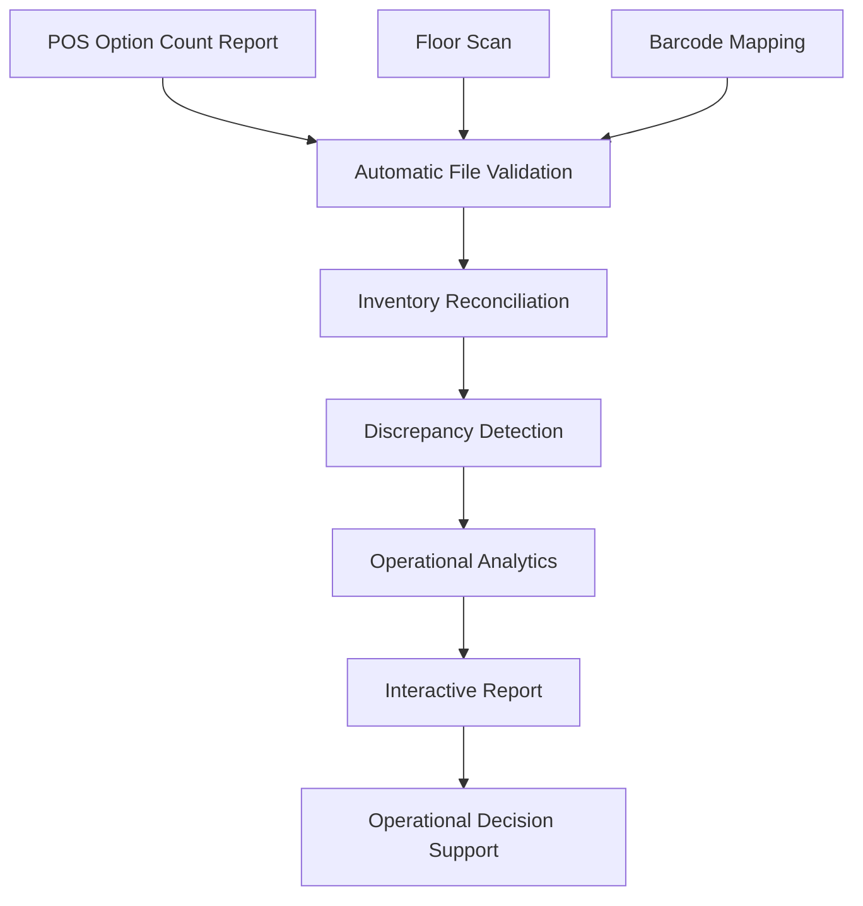

# POS Option Count Automation

### Retail Inventory Verification & Floor Validation

> Transforming retail floor scans into accurate inventory validation and operational insights.


The **POS Option Count Automation** platform streamlines retail inventory verification by automatically comparing floor scan data against POS option count reports. Through barcode reconciliation, automated validation, and standardized reporting, the platform significantly reduces manual effort while improving inventory accuracy and operational visibility.

---


---

## Quick Links

**Live Application**

*(Coming Soon)*

**Portfolio Case Study**

*(Coming Soon)*

---

# Executive Summary

The POS Option Count Automation platform replaces a repetitive manual inventory validation process with an automated workflow.

Instead of manually comparing hundreds of scanned products against POS reports, users simply upload the required files while the application validates, reconciles, analyzes, and generates standardized operational reports.

The result is a faster, more reliable, and consistent inventory verification process that supports merchandising, replenishment, and daily retail operations.

---

# The Challenge

Maintaining an accurate sales floor is essential for inventory accuracy, replenishment planning, and customer experience.

Traditionally, validating floor inventory required manually comparing POS option count reports against barcode scan results—a repetitive process that could take several hours every reporting cycle while remaining susceptible to human error.

As store size and product assortment increased, maintaining an efficient validation process became increasingly difficult.

---

# The Solution

The platform transforms a manual inventory reconciliation process into a guided automation workflow that validates uploaded files, compares scanned products against expected inventory, identifies discrepancies, prioritizes corrective actions, and generates standardized operational reports.

---

# Workflow



From raw inventory data to operational decision support, every stage of the validation process is automated to improve consistency, reduce manual effort, and accelerate decision-making.

---

# Application Overview

The application provides an intuitive workflow that guides users through inventory uploads, validation, barcode reconciliation, and report generation from a single interface.


---

# Guided Upload Workflow

Users upload the POS Option Count report and Floor Scan file while the platform automatically validates each input before processing. A default barcode mapping is included, with the flexibility to upload a custom mapping when required.


---

# Executive Summary & Priority Actions

Once processing is complete, the platform immediately presents key inventory metrics together with prioritized missing products, allowing store teams to focus on the highest-impact corrective actions.


---

# Operational Insights

The platform summarizes inventory discrepancies by department and brand, helping managers quickly identify operational patterns, replenishment priorities, and merchandising opportunities.


---

# Actionable Operational Report

In addition to the interactive dashboard, the platform exports a fully formatted Excel report that categorizes every scanned product, highlights missing inventory, flags unexpected items, and recommends operational actions for each discrepancy.


---

# Business Impact

The POS Option Count Automation platform replaces a repetitive manual inventory validation workflow with a standardized inventory reconciliation process.

### Benefits

- Reduced report preparation time from approximately **5 hours to 30 minutes**
- Standardized inventory validation
- Reduced manual reconciliation
- Improved reporting consistency
- Faster identification of inventory discrepancies
- Prioritized operational recommendations
- Better merchandising decision support

---

# Key Capabilities

- Automatic file identification
- Guided upload workflow
- Barcode reconciliation
- Inventory validation
- Missing item detection
- Unexpected item detection
- Priority product identification
- Department and brand analysis
- Interactive operational dashboard
- Excel report generation

---

# Technology Stack

| Layer | Technologies |
|--------|--------------|
| **Backend** | Python |
| **User Interface** | Streamlit |
| **Data Processing** | Pandas |
| **Reporting** | OpenPyXL · XlsxWriter |
| **Validation Engine** | Barcode Mapping · Inventory Reconciliation |

---

# Repository Structure

```text
📁 app.py
   Main Streamlit application

📁 report_generator.py
   Inventory validation engine

📁 assets/
   Images and application resources

📁 requirements.txt
   Project dependencies
```

---

# Roadmap

## Next Release

- Enhanced dashboard visualizations
- Improved validation summaries
- Additional operational KPIs
- Performance optimization

## Future Vision

- Multi-store reporting
- Historical inventory comparisons
- Cloud deployment
- Scheduled inventory audits
- Integration with inventory management systems

---

# About the Author

**Diego Díaz Iturbe**

**Data Analytics • Automation • Cloud • GIS**

Building practical decision-support systems through analytics, automation, and visualization.

**Portfolio**

https://impactomex.wixsite.com/eportfolio

**LinkedIn**

https://www.linkedin.com/in/diaziturbe/