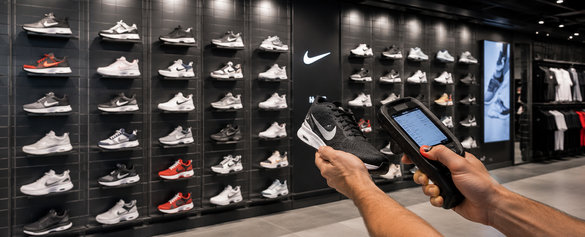
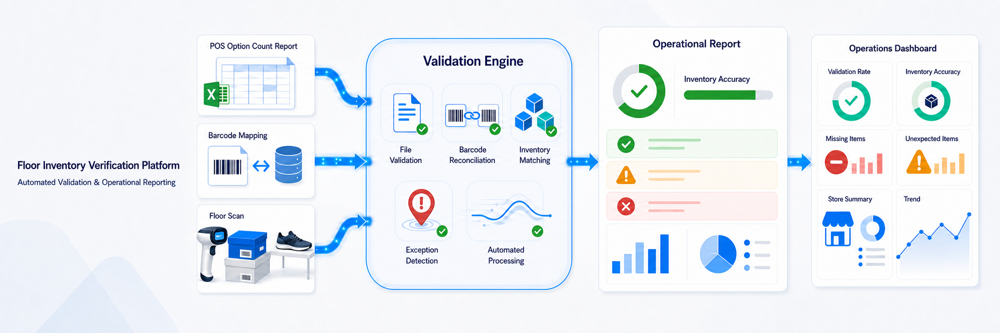
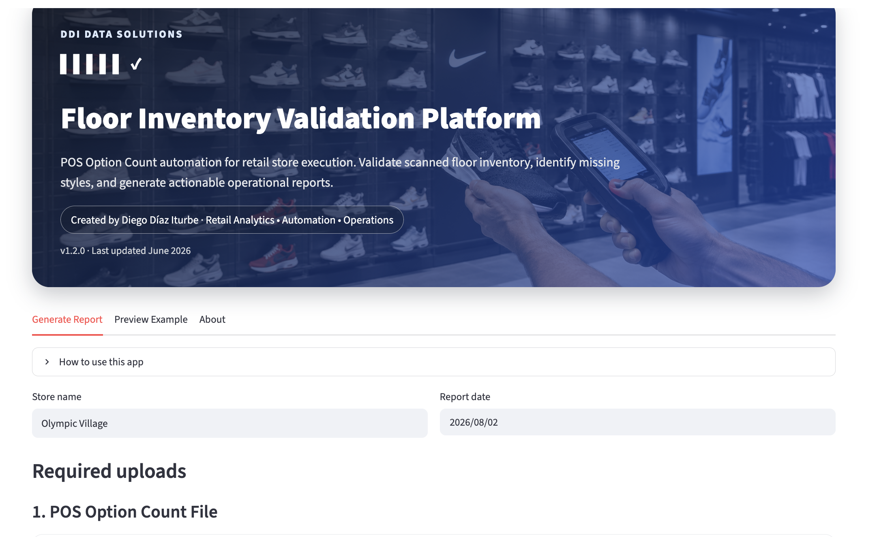
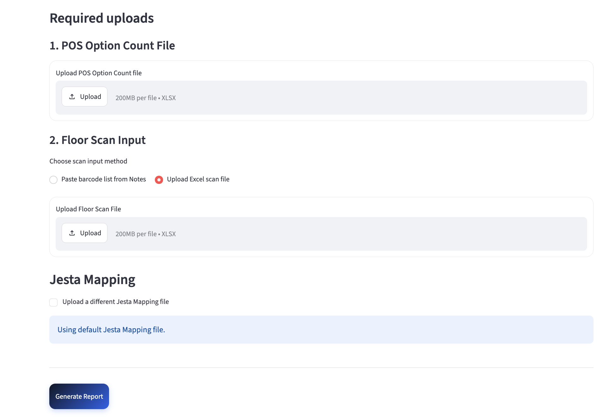
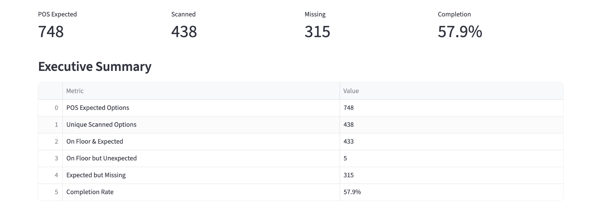
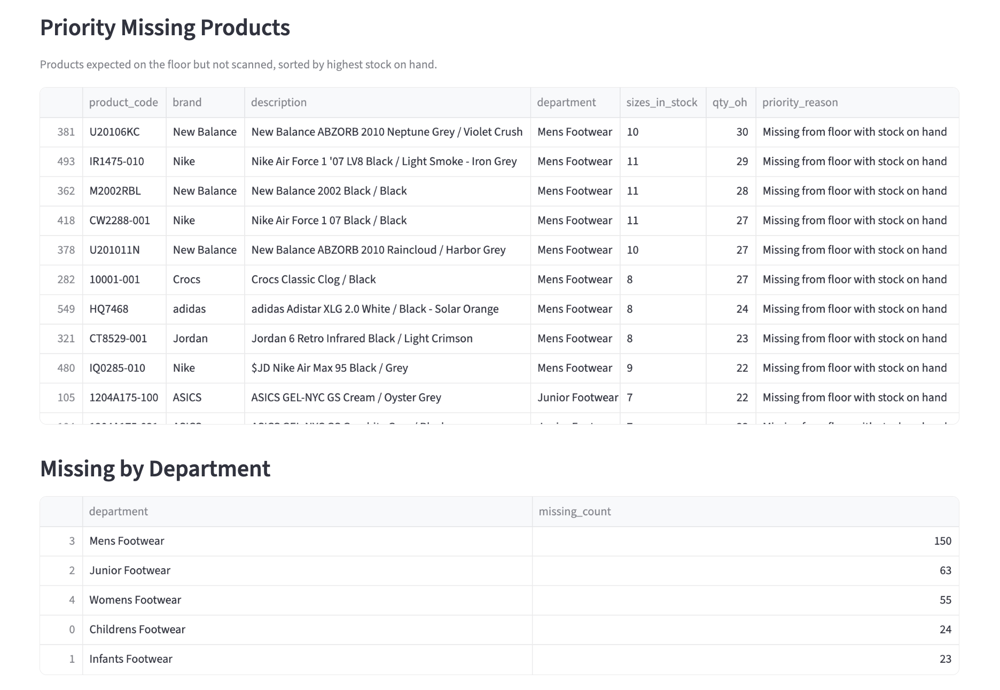
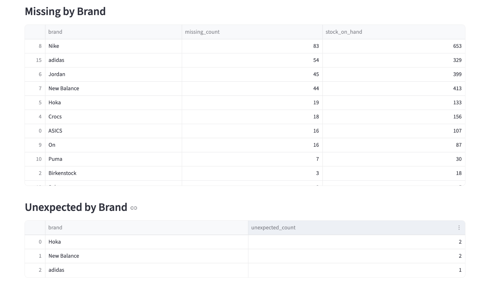
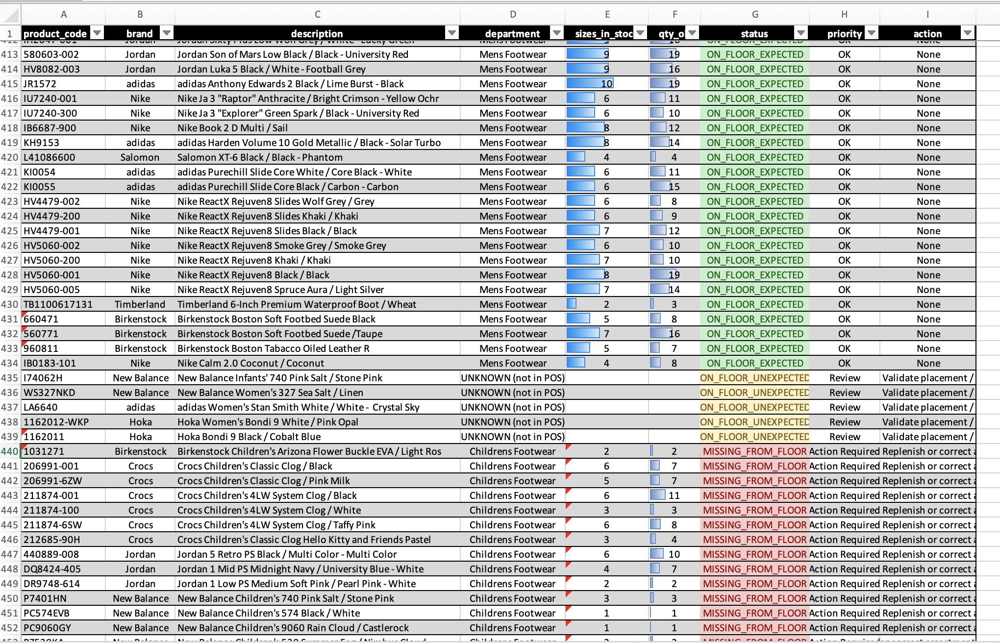

# Floor Inventory Validation Platform

### Operational Decision-Support for Retail Inventory Execution

Transforming raw inventory scans into prioritized operational actions.




---


---

## Live Application

https://pos-option-count-app-yryunnktg2cxgfm3bh6ysf.streamlit.app/


---

## Executive Summary

The **Floor Inventory Validation Platform** is an operational decision-support application that helps retail teams verify floor execution against expected inventory.

Instead of manually comparing inventory reports against floor scans, the platform automatically identifies discrepancies, prioritizes corrective actions, and generates operational reports that allow store teams to resolve issues faster.

Designed for daily retail operations, the application transforms raw inventory data into clear, actionable recommendations.

---

## Project Snapshot

- **Status:** Production
- **Workflow Time:** 5 hours → ~30 minutes
- **Time Reduction:** ~90%
- **Inputs:** POS Report, Floor Scan
- **Outputs:** Operational Report, Excel

---

## The Challenge

Large retail stores carry hundreds of footwear and apparel styles distributed across multiple departments.

Verifying that every expected product is correctly displayed on the sales floor traditionally requires manually comparing inventory reports against physical inspections.

This process is repetitive, time-consuming, and makes it difficult to quickly identify:

- Missing products
- Unexpected inventory
- Assortment execution issues
- Replenishment opportunities

---

## The Solution

The platform automates the inventory validation workflow by:

- Importing weekly POS inventory expectations
- Processing barcode scans collected on the sales floor
- Matching products against the merchandise database
- Detecting missing and unexpected inventory
- Prioritizing products requiring immediate action
- Producing operational reports for store execution

Instead of reviewing hundreds of inventory records manually, managers receive a prioritized action list within minutes.



---

## Results

The implementation standardized the inventory validation process and significantly reduced the time required to identify merchandising discrepancies.

## Business Impact

The platform transformed a manual inventory validation process into a standardized decision-support workflow for retail operations.

Key outcomes include:

- Reduced inventory validation time from approximately **5 hours to around 30 minutes** (≈90% reduction)
- Standardized the floor verification process
- Eliminated repetitive manual comparison between reports and floor scans
- Automatically prioritized products requiring immediate attention
- Improved visibility into inventory execution by department and brand
- Generated consistent operational reports for store management

---

# Application Workflow

```text
                 POS Inventory
                       │
                       ▼
              Floor Barcode Scan
                       │
                       ▼
          Inventory Validation Engine
                       │
                       ▼
             Product Classification
                       │
          ┌────────────┴────────────┐
          ▼                         ▼
 Missing Products          Unexpected Products
          │
          ▼
      Priority Ranking
          │
          ▼
   Operational Action Report
          │
          ▼
      Store Action Plan
```

---

# Guided Workflow

The application provides a structured workflow that guides users from data upload through automated validation and report generation.

Minimal user interaction is required, allowing operational staff to generate reports consistently without technical knowledge.



---

# Inventory Processing

Weekly inventory expectations and floor scans are uploaded through a guided interface.

The platform validates every uploaded file before processing begins, reducing preparation errors and ensuring consistent data quality.



---

# Operational Dashboard

After processing, managers receive an executive dashboard summarizing inventory execution.

The dashboard immediately highlights overall completion, missing products, unexpected items, and key operational indicators.



---

# Priority Actions

Rather than presenting raw inventory data, the platform ranks missing products according to business impact.

Products that are expected on the sales floor but remain in stock are automatically prioritized, allowing teams to focus first on the actions that will have the greatest operational value.



---

# Operational Insights

Inventory discrepancies are summarized by department and by brand, allowing managers to identify recurring execution issues and prioritize merchandising efforts.

These summaries provide an immediate understanding of where operational attention is required.



---

# Operational Action Report

Every inventory validation produces a structured operational report.

Each product is classified according to its execution status and assigned a recommended action, allowing store teams to begin replenishment, validation, or assortment correction immediately.



---

# Business Impact

The platform transforms raw inventory scans into actionable operational intelligence.

### Benefits

- Faster inventory validation
- Reduced manual comparison
- Standardized reporting
- Prioritized corrective actions
- Improved merchandising execution
- Better inventory visibility
- Consistent decision support

---

## Key Capabilities

- Guided upload workflow
- Barcode reconciliation
- POS validation
- Product classification
- Missing inventory detection
- Unexpected inventory detection
- Priority ranking
- Department analysis
- Brand analysis
- Executive dashboard
- Operational report generation

---

## Technology Stack

| Category | Technologies |
|----------|--------------|
| Programming | Python |
| Framework | Streamlit |
| Data Processing | Pandas |
| Reporting | HTML, Excel |
| Data Analysis | NumPy |
| Excel Automation | OpenPyXL |

---

## Repository Structure

```text
app.py
Main Streamlit application

report_generator.py
Inventory processing engine

assets/
README images

requirements.txt
Project dependencies
```

---

## Future Roadmap

### Next Release

- PDF report generation
- Interactive visualizations
- Historical inventory trends
- Performance improvements

### Future Vision

- Multi-store support
- Regional dashboards
- Power BI integration
- Cloud deployment
- Predictive inventory analytics
- Mobile-friendly reports

---

## About the Author

**Diego Díaz Iturbe**

Data Analytics • Automation • Cloud • GIS

I enjoy solving operational problems by combining data analytics, automation, and visualization into practical decision-support systems.

- Portfolio: https://impactomex.wixsite.com/eportfolio
- LinkedIn: https://linkedin.com/in/diaziturbe

---

*If you found this project interesting, feel free to star the repository or connect with me on LinkedIn.*
